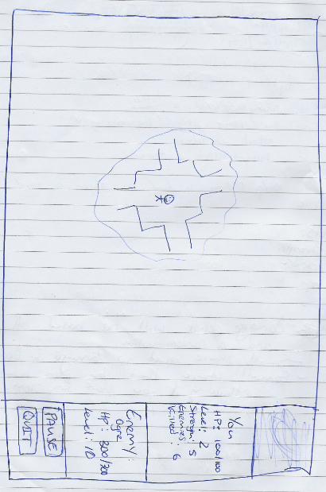

# Roguelike Planning Document

## Question 1
The players and enemies will be in different classes from the same family, but items will be in completely different classes/family.
This is because items are simply not characters like enemies and players, and will not require complex methods that they have.

## Question 2
The form will act as the game manager class. There will not be a dedicated game manager class as this is bad practice as it will create a "god" class.
Therefore, the form will contain all of the logic that a game manager class would normally contain.

## Question 3
**Classes required to implement dungeon:**

* **Dungeon**
    * Class job: Generates overall dungeon and connects rooms together with corridors
    * **Methods:**
      * 

* **TileMap**
    * Class Job: Generate the overall dungeon by generating a 2D array of integers which represent each tile.
    * **Methods:**
        * SetMapEntry(int col, int row)
        * DrawMap()
        * GenerateRoom()
        * GenerateCorridor()
        * CheckOverlap()
        
    * **Data Members:**
        * map : 2D int array
        * int nCols;
        * int nRows;
        * rooms : array of Room
        * TileList tileList
        
* **Room**
    * Class Job: Generate a room so that corridor(s) can connect to it.
    * **Methods:**
        * GenerateRoom()
        
    * **Data Members:**
        * roomMap : 2D int array
        * startDrawX : int
        * startDrawY : int
        * width : int
        * height : int
        
## Question 4
A linked list will be used for both enemies and items as this is more efficient.

## Question 5
The dungeon does not need pointers to its sprites as only the sprite needs to know where it is in the dungeon.

## Question 6
The sprite class will not need a pointer to the dungeon as the sprite only needs to know its X and Y positions in the world.
The calculations on what tile or which specific room in the dungeon is not calculated in the sprite class.

## Question 7
* SpriteDirections
* Constants
* Tile
* BoundsAction

## Question 8
No the player sprite does not need access to enemies as the form will control the interactions between the two.

## Question 9
The form will be responsible for creating  the collections of enemies and items as this will also control them.

## Question 10
The form class for main character because there is only a single sprite for that. There will be a method in SpriteList class for enemies as the SpriteList has the most direct access to each enemy sprite. The form will then call the SpriteList class' method.

## Question 11
The SpriteList of enemies will be checking if they have collided with the main character.

**Function Header:**
   SpriteList::CheckForCollision(Sprite^ mainCharacter)

**Classes involved in collision detection:**
   * Form
   * Sprite

## Question 12
**AI Behaviour:**
* Wander the room
* Stop moving
* Chase player if they are from a certain distance & stop chasing once the player leaves the "aggro" rectangle.
   * If not in same room, stop and wander again.

## Question 13
The blobbo bomber will use trigonometry to calculate the direction to the player, so it can move towards it.

## Question 14
The battle system will be 'turn based'.

**Psuedo code Battle Algorithm:**
while the enemy and player is not dead

   check if enemy attack mode is true
   
      enemy attacks player
      
      check if the player is dead
      
      enemy attack mode is false
      
      player attack mode is true

   player attack mode is true
   
      player attacks enemy
      
      check if the enemy is dead
      
      player attack mode is false
      
      enemy attack mode is true

The enemy and player will both have stats which will dictate how much damage is dealt:
- Strength (this will affect how much damage is dealt to the opposition)
- Defence (the opposition's defence will dictate how much damage is dealt)
- Health (the total health a sprite has)

The amount of damage dealt will also have a random value added to it to keep the game realistic.

Within the attacking mechanism, there will be small random chances of events occurring:
- Chance that no damage is dealt
- Chance that you gain health when attacking if you have a certain item

Battle feedback will be displayed on the info pane on the right-side of the application.

## Screen Sketch:

